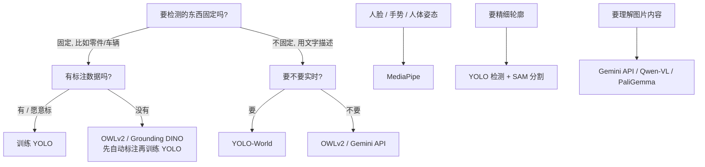

> [!NOTE]
> 人脸识别另有一篇：[InsightFace 人脸分析](/blog/2026/08/06/face-comparison/)。这篇讲通用的视觉任务。

## 1. 视觉任务分类

| 任务 | 输出 | 例子 |
|--|--|--|
| **图像分类** Classification | 整张图一个类别 | 这是猫还是狗 |
| **目标检测** Detection | 每个物体一个框 + 类别 | 找出画面里所有的人和车 |
| **实例分割** Segmentation | 每个物体的像素轮廓 | 抠出每个人 |
| **姿态估计** Pose | 人体 / 手部的关键点 | 动作识别、手势控制 |
| **旋转框检测** OBB | 带角度的框 | 航拍图里的船、车 |
| **目标跟踪** Tracking | 跨帧保持同一个 ID | 统计进出人数 |
| **开放词汇检测** Open-Vocabulary | 用文字描述检测任意物体，不用训练 | "找出红色的杯子" |
| **视觉大模型** VLM | 看图回答问题、输出框 | "图里有几个人？各在做什么" |

## 2. 模型对比与选择

### 2.1 常用模型

| 模型 | 出品方 | 擅长 | 优点 | 注意 |
|--|--|--|--|--|
| **[YOLO](https://docs.ultralytics.com/)**（Ultralytics） | Ultralytics | 检测、分割、姿态、OBB、分类、跟踪 | 速度快、一套代码做全部任务、训练和导出最方便 | **AGPL-3.0**，闭源商用要买授权 |
| [RF-DETR](https://github.com/roboflow/rf-detr) / RT-DETR | Roboflow / 百度 | 检测 | Transformer 检测器，精度高；RF-DETR 是 Apache-2.0 | 生态比 YOLO 小 |
| **[MediaPipe](https://ai.google.dev/edge/mediapipe/solutions/guide)** | Google | 人脸、手势、人体姿态、简单检测 | 开箱即用、手机和浏览器都能实时跑、Apache-2.0 | 只能用现成任务，自定义能力弱 |
| **[OWLv2](https://huggingface.co/google/owlv2-base-patch16-ensemble)** | Google | 开放词汇检测 | 输入文字就能检测，不用训练 | 速度慢，精度不如专门训练的 YOLO |
| [SigLIP 2](https://huggingface.co/collections/google/siglip2-67b5dcef38c175486e240107) / CLIP | Google / OpenAI | 图文向量、以文搜图、零样本分类 | 做图片检索、相似图去重 | 只出向量，不出框 |
| [PaliGemma](https://ai.google.dev/gemma/docs/paligemma) / Gemma | Google | 本地视觉大模型 | 开放权重，可微调 | 需要较大显存 |
| **[Gemini API](https://ai.google.dev/gemini-api/docs/image-understanding)** | Google | 看图问答、检测、分割 | 最省事，一句提示词就能检测任意物体 | 云端调用，按量付费，图片要上传 |
| **[SAM](https://github.com/facebookresearch/sam2)**（Segment Anything） | Meta | 分割任意物体 | 给一个点或框就能抠出精细轮廓 | 本身不知道物体是什么类别 |
| [Grounding DINO](https://github.com/IDEA-Research/GroundingDINO) / YOLO-World | IDEA / 腾讯 | 开放词汇检测 | 比 OWLv2 更快 / 更准 | — |
| [Qwen-VL](https://huggingface.co/Qwen) | 阿里 | 本地视觉大模型 | 中文好，能输出检测框 | 需要较大显存 |

### 2.2 怎么选



一句话：

- **固定类别的检测、分割：训练 YOLO**，这是目前落地最多的方案。
- **人脸、手、人体关键点：直接用 MediaPipe**，不用自己训练。
- **没有数据、类别不固定：开放词汇模型或 Gemini API**，也可以用它们先自动标注，再训练 YOLO。
- **商用闭源产品注意 YOLO 的 AGPL 许可证**，不想买授权就换 RF-DETR 等 Apache-2.0 的模型（见第 8 节）。

## 3. YOLO 上手

### 3.1 安装与推理

```bash
pip install ultralytics
# 有 NVIDIA 显卡的话，先按 pytorch.org 的命令装 CUDA 版 PyTorch，再装 ultralytics
```

命令行一条就能跑，模型第一次会自动下载：

```bash
yolo predict model=yolo11n.pt source=bus.jpg          # 图片
yolo predict model=yolo11n.pt source=0 show=True      # 摄像头
yolo predict model=yolo11n-seg.pt source=video.mp4    # 视频 + 分割
```

结果默认保存在 `runs/detect/predict/`。Python 写法：

```python
from ultralytics import YOLO

model = YOLO("yolo11n.pt")
results = model("bus.jpg", conf=0.25)

for box in results[0].boxes:
    cls = results[0].names[int(box.cls)]
    x1, y1, x2, y2 = box.xyxy[0].tolist()
    print(cls, round(float(box.conf), 2), [round(v) for v in (x1, y1, x2, y2)])

results[0].save("out.jpg")   # 画好框的图
```

### 3.2 模型怎么选

文件名 = 版本 + 尺寸 + 任务后缀：

| 部分 | 可选值 |
|--|--|
| 版本 | `yolov8`、`yolo11` 等，**用文档里最新推荐的版本** |
| 尺寸 | `n`（最快）→ `s` → `m` → `l` → `x`（最准） |
| 任务 | 无后缀 = 检测，`-seg` 分割，`-pose` 姿态，`-obb` 旋转框，`-cls` 分类 |

例如 `yolo11s-seg.pt` 就是 YOLO11 小尺寸分割模型。**先用 `n` / `s` 跑通，精度不够再换大的。**

### 3.3 目标跟踪

```bash
yolo track model=yolo11n.pt source=video.mp4 tracker=bytetrack.yaml
```

每个框会多一个 `id`，跨帧保持不变，用来计数、画轨迹。

### 3.4 训练自己的数据

**1. 标注数据**，常用工具：

| 工具 | 说明 |
|--|--|
| [X-AnyLabeling](https://github.com/CVHub520/X-AnyLabeling) | 桌面应用，内置 YOLO / SAM 自动标注，直接导出 YOLO 格式 |
| [Label Studio](https://labelstud.io/) | 网页版，多人协作 |
| [CVAT](https://www.cvat.ai/) | 功能最全，适合大项目 |
| [Roboflow](https://roboflow.com/) | 在线标注 + 数据增强 + 导出，免费版数据公开 |

**2. 整理成 YOLO 格式：**

```text
datasets/parts/
├── images/
│   ├── train/   001.jpg ...
│   └── val/
└── labels/
    ├── train/   001.txt ...     # 和图片同名
    └── val/
```

每个 `.txt` 一行一个物体：`类别编号 中心x 中心y 宽 高`，坐标都是 0～1 的比例：

```text
0 0.512 0.430 0.210 0.180
1 0.250 0.700 0.100 0.150
```

**3. 写数据配置 `parts.yaml`：**

```yaml
path: datasets/parts
train: images/train
val: images/val
names:
  0: screw
  1: nut
```

**4. 训练：**

```bash
yolo train model=yolo11s.pt data=parts.yaml epochs=100 imgsz=640 batch=16
```

| 参数 | 说明 |
|--|--|
| `model` | 从预训练模型开始微调，比从零训练快得多 |
| `epochs` | 训练轮数，先 100 轮看效果 |
| `imgsz` | 输入尺寸，小物体多的话调大到 960 / 1280 |
| `batch` | 显存不够就调小，或者写 `-1` 自动选择 |
| `device` | `0` 用第一张显卡，`cpu` 用 CPU，Mac 用 `mps` |

**5. 看结果、验证：** 最好的权重在 `runs/detect/train/weights/best.pt`，同目录下有损失曲线、混淆矩阵、预测样例。

```bash
yolo val model=runs/detect/train/weights/best.pt data=parts.yaml
yolo predict model=runs/detect/train/weights/best.pt source=test/
```

> [!TIP]
> 数据量参考：每个类别先准备 **几百张**、覆盖不同光照 / 角度 / 背景。效果不好时，先检查标注质量和数据多样性，再考虑换大模型。

### 3.5 导出与部署

```bash
yolo export model=best.pt format=onnx
```

| format | 用在 |
|--|--|
| `onnx` | 通用格式，配合 ONNX Runtime 在 CPU / GPU 上跑，**不确定就选它** |
| `engine` | NVIDIA TensorRT，显卡和 Jetson 上最快 |
| `openvino` | Intel CPU / 核显 |
| `coreml` | iPhone、Mac |
| `tflite` | Android、树莓派 |
| `rknn` | 瑞芯微（RK3588 等）开发板 |

导出后的模型仍然可以用 `YOLO("best.onnx")` 加载推理，代码不用改。

## 4. MediaPipe：人脸、手势、姿态

Google 出品，模型已经训练好，下载一个 `.task` 文件就能用，手机和浏览器上也能实时跑。

| 任务 | 输出 |
|--|--|
| Face Detector / Face Landmarker | 人脸框 / 478 个面部关键点、表情系数 |
| Hand Landmarker | 每只手 21 个关键点 |
| Gesture Recognizer | 手势类别（点赞、比耶、握拳等） |
| Pose Landmarker | 人体 33 个关键点 |
| Object Detector | 常见物体检测 |
| Image Segmenter | 人像抠图、头发 / 衣服分割 |

**1. 安装并下载模型：**

```bash
pip install mediapipe
curl -o hand_landmarker.task https://storage.googleapis.com/mediapipe-models/hand_landmarker/hand_landmarker/float16/latest/hand_landmarker.task
```

其他任务的模型下载地址在 [官方文档](https://ai.google.dev/edge/mediapipe/solutions/guide) 对应任务的 *Models* 部分。

**2. 识别手部关键点：**

```python
import mediapipe as mp
from mediapipe.tasks import python
from mediapipe.tasks.python import vision

options = vision.HandLandmarkerOptions(
    base_options=python.BaseOptions(model_asset_path="hand_landmarker.task"),
    num_hands=2,
)
detector = vision.HandLandmarker.create_from_options(options)

result = detector.detect(mp.Image.create_from_file("hand.jpg"))
for hand in result.hand_landmarks:
    tip = hand[8]                      # 8 号点是食指指尖
    print(round(tip.x, 3), round(tip.y, 3))   # 0～1 的比例，乘以图片宽高得到像素
```

> [!NOTE]
> 网上很多教程用的是 `mp.solutions.hands` 这种旧写法，官方已经不再维护，新项目用上面的 **Tasks API**。浏览器里用 `@mediapipe/tasks-vision` 这个 npm 包，写法基本一样。

## 5. 开放词汇检测：OWLv2

不用训练，给文字标签就能检测：

```bash
pip install transformers torch pillow
```

```python
from transformers import pipeline

detector = pipeline("zero-shot-object-detection", model="google/owlv2-base-patch16-ensemble")
results = detector("street.jpg", candidate_labels=["bicycle", "traffic light", "dog"], threshold=0.2)

for r in results:
    print(r["label"], round(r["score"], 2), r["box"])   # box 是像素坐标 xmin/ymin/xmax/ymax
```

- 标签用**英文**效果最好
- 速度比 YOLO 慢很多，适合离线处理，或者**给训练 YOLO 做自动预标注**

## 6. Gemini API：一句话检测

最省事的方案，适合原型验证、数据量不大的场景：

```bash
pip install google-genai pillow
# 在 aistudio.google.com 申请 API Key，设置环境变量 GEMINI_API_KEY
```

```python
from google import genai
from PIL import Image

client = genai.Client()
img = Image.open("street.jpg")

resp = client.models.generate_content(
    model="gemini-2.5-flash",          # 换成文档里最新的型号
    contents=[img, "检测图中所有的自行车和行人。只返回 JSON 列表，每项包含 label 和 box_2d。"],
)
print(resp.text)
```

返回的 `box_2d` 是 `[ymin, xmin, ymax, xmax]`，范围 **0～1000**，换算成像素：

```python
x1, y1 = xmin / 1000 * img.width, ymin / 1000 * img.height
```

> [!WARNING]
> 图片会上传到 Google 服务器，涉及隐私或保密的数据不要用，改用本地模型。

## 7. SAM：精细分割

SAM 负责"抠图"：给它一个框或一个点，输出精细的轮廓。和 YOLO 组合就能得到带类别的精细分割：

```python
from ultralytics import YOLO, SAM

boxes = YOLO("yolo11n.pt")("bus.jpg")[0].boxes.xyxy     # 1. YOLO 找框
masks = SAM("sam2.1_b.pt")("bus.jpg", bboxes=boxes)     # 2. SAM 按框抠轮廓
masks[0].save("sam.jpg")
```

也可以只给一个点：`SAM("sam2.1_b.pt")("bus.jpg", points=[[400, 370]], labels=[1])`。

## 8. 许可证

| 模型 | 许可证 | 商用 |
|--|--|--|
| Ultralytics YOLO（v8、11 等） | AGPL-3.0 | 可以，但**整个项目要开源**；闭源需购买 Ultralytics 企业授权 |
| RF-DETR | Apache-2.0 | 可以 |
| MediaPipe | Apache-2.0 | 可以 |
| OWLv2、SigLIP | Apache-2.0 | 可以 |
| SAM 2 | Apache-2.0 | 可以 |
| PaliGemma / Gemma | Gemma 使用条款 | 可以，需遵守使用限制 |
| Gemini API | Google 服务条款 | 按量付费 |

> [!WARNING]
> AGPL 的"开源义务"对**通过网络提供服务**也生效：把 YOLO 部署在服务器上给别人调用，同样要公开源码。做公司项目前先确认许可证。

## 9. 数据集与模型平台

| 平台 | 说明 |
|--|--|
| [Roboflow Universe](https://universe.roboflow.com/) | 大量现成的标注数据集，可直接导出 YOLO 格式 |
| [Hugging Face](https://huggingface.co/models?pipeline_tag=object-detection) | 按任务筛选视觉模型 |
| [Kaggle](https://www.kaggle.com/datasets) | 数据集和 Google 官方模型 |
| [COCO](https://cocodataset.org/) | 80 类通用物体，YOLO 预训练用的就是它 |
| [魔搭 ModelScope](https://modelscope.cn/models) | 国内下载模型快 |

## 10. 常见问题

| 现象 | 原因与解决 |
|--|--|
| 推理很慢 | 确认用上了 GPU：`python -c "import torch; print(torch.cuda.is_available())"` 输出 `True`；否则重装 CUDA 版 PyTorch |
| 训练时显存不足 | 调小 `batch` 或 `imgsz`，换小一号的模型 |
| 小物体检测不到 | 调大 `imgsz`；标注时别漏标小物体；拍摄时离近一点 |
| 误检多 | 调高 `conf` 阈值；训练集里加入没有目标的负样本图片 |
| 训练集效果好、实际场景差 | 训练数据和真实场景差异大，补充真实场景的图片 |
| MediaPipe 坐标对不上 | 输出是 0～1 的比例，要乘以图片宽高 |

## 11. 相关链接

| 链接 | 说明 |
|--|--|
| [Ultralytics 文档](https://docs.ultralytics.com/zh/) | YOLO 训练、导出、部署，有中文 |
| [MediaPipe 文档](https://ai.google.dev/edge/mediapipe/solutions/guide) | 各任务的模型与示例 |
| [Gemini 图像理解](https://ai.google.dev/gemini-api/docs/image-understanding) | 检测、分割的提示词写法 |
| [Hugging Face 零样本检测](https://huggingface.co/docs/transformers/tasks/zero_shot_object_detection) | OWLv2 用法 |
| [SAM 2](https://github.com/facebookresearch/sam2) | Meta 官方仓库 |
| [Roboflow Blog](https://blog.roboflow.com/) | 大量视觉模型对比和教程 |
