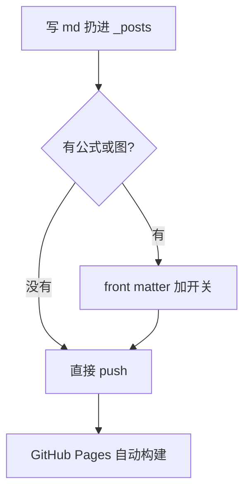

这篇不讲内容，只做自检。改完 `main.css` 或 `site.js` 之后打开它，下面每一节都应该
是描述的样子；哪节不对，问题就在那一块。

## 图片与图注

图片放在 `assets/img/posts/<文章-slug>/` 下，正文里写绝对路径。图片独占一段时，
`alt` 会被 JS 兜成图注显示在下方。


**应该看到**：图片带细边框、居中的小号灰色图注，且 `` 上有 `loading="lazy"`。

行内的图不加图注 —— 这行末尾跟一个  就不该冒出 caption。

## 数学公式

front matter 里写了 `math: true` 才会加载 MathJax，没写的文章不拉这 100KB。
行内公式像 $$a^2 + b^2 = c^2$$ 这样嵌在句子里，块级的单独占一段：

$$
\sum_{i=1}^{n} i = \frac{n(n+1)}{2}
$$

$$
\int_{0}^{\infty} e^{-x^2} dx = \frac{\sqrt{\pi}}{2}
$$

**应该看到**：公式是排版好的数学符号，不是一串 `\sum` 源码。深色模式下公式跟着
正文变色 —— MathJax 用 `currentColor`，不用额外配。

> 注意 kramdown 只认 `$$...$$`，单个 `$` 不当公式。代码块里的 `$` 也不会被误伤，
> MathJax 默认跳过 `pre` 和 `code`。

## 流程图

同理，`mermaid: true` 才加载。代码块的语言标成 `mermaid` 就行：



**应该看到**：一张真的流程图，而不是代码块；它头上**不该**有语言角标和复制按钮
（`enhanceCode` 对 mermaid 块做了跳过）。深色模式下整张图会被反色处理。

## 代码块

普通代码块不受影响，角标和复制按钮照旧：

```python
def fib(n):
    a, b = 0, 1
    for _ in range(n):
        a, b = b, a + b
    return a
```

## 表格、引用与提示块

| 开关 | 写在哪 | 不写的后果 |
|---|---|---|
| `math: true` | front matter | `$$` 原样显示成源码 |
| `mermaid: true` | front matter | 流程图退化成普通代码块 |

> 普通引用块：细灰竖条，灰字，比正文小一号。

GitHub 风格的提示块，五种：

> [!NOTE]
> 一般说明。蓝色。

> [!TIP]
> 顺手的小技巧。绿色。

> [!IMPORTANT]
> 别漏掉的前提。紫色。

> [!WARNING]
> 做错会出问题。琥珀色。

> [!CAUTION]
> 有破坏性，想清楚再动。红色。

标记后加 `-` 默认收起、加 `+` 默认展开，用的是原生 `<details>`：

> [!TIP]-
> 收起状态，点标题这行展开。
>
> 折叠块里段落、代码、列表都正常。

> [!WARNING]+
> 展开状态，可以再点收起。

类型不设白名单，随便写一个就是自定义提示块，走默认蓝 + 方块图标；
要给它单独配色，在 `main.css` 里照抄一行 `.prose .callout[data-callout=xxx]{--cl:…}` 即可，JS 不用动：

> [!SPOILER]
> 自定义类型，没配色就是默认那套。

自检完了。这篇可以一直留着，也可以看完删掉。
