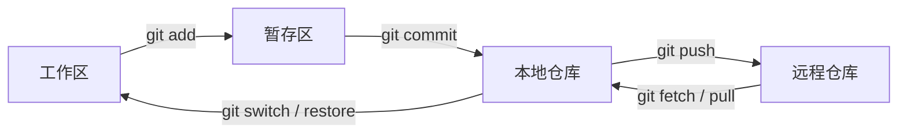
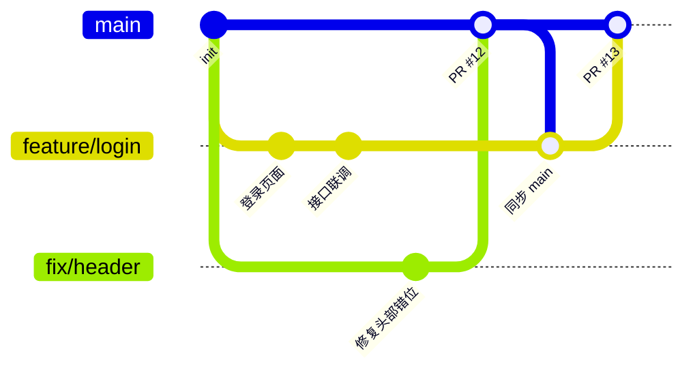

## 1. 先搞懂四个区域

Git 里的文件只在这四个地方流转，命令说到底就是在它们之间搬东西：



- **工作区**：你正在编辑的文件。
- **暂存区**：下一次提交要包含的改动，用 `git add` 挑进去。
- **本地仓库**：`git commit` 之后的历史，存在 `.git` 目录里。
- **远程仓库**：GitHub / GitLab / Gitee 上的那份，团队共享。

## 2. 安装与首次配置

```bash
# 查看版本，确认安装成功
git --version

# 身份信息，会写进每一次提交
git config --global user.name  "你的名字"
git config --global user.email "you@example.com"

# 新仓库默认分支叫 main
git config --global init.defaultBranch main

# 默认编辑器改成 VS Code（写提交说明、解决冲突时会用到）
git config --global core.editor "code --wait"

# Windows 上：提交时转 LF、检出时转 CRLF
git config --global core.autocrlf true

# 中文文件名不再显示成 \346\226\207 这种转义
git config --global core.quotepath false

# 查看所有配置
git config --list --show-origin
```

> [!TIP]
> 推荐用 SSH 连接远程仓库，省去每次输密码：`ssh-keygen -t ed25519 -C "you@example.com"` 生成密钥，把 `~/.ssh/id_ed25519.pub` 的内容贴到 GitHub → Settings → SSH and GPG keys，最后用 `ssh -T git@github.com` 测试。

## 3. 基础命令

### 3.1 创建与获取仓库

```bash
git init                                  # 把当前目录变成 Git 仓库
git clone git@github.com:user/repo.git    # 克隆远程仓库
git clone <url> my-dir                    # 克隆到指定目录
```

### 3.2 日常三件套：查看、暂存、提交

```bash
git status              # 现在什么状态？最常用，不确定就先敲它
git diff                # 工作区 vs 暂存区：还没 add 的改动
git diff --staged       # 暂存区 vs 上次提交：add 了、准备提交的改动

git add file.txt        # 暂存单个文件
git add .               # 暂存当前目录下所有改动
git add -p              # 逐块挑选要暂存的改动，适合把一堆改动拆成多次提交

git commit -m "feat: 新增登录页"   # 提交
git commit --amend                  # 修改最近一次提交（还没 push 时用）
```

`git diff` 的输出长这样：`-` 开头是删掉的行，`+` 开头是新加的行，`@@` 标出改动在文件里的位置：

```diff
diff --git a/src/config.js b/src/config.js
index 3f2a1c0..8b7d9e4 100644
--- a/src/config.js
+++ b/src/config.js
@@ -1,5 +1,6 @@
 export const config = {
-  timeout: 3000,
+  timeout: 5000,
+  retry: 2,
   baseURL: "/api",
   debug: false,
 };
```

### 3.3 查看历史

```bash
git log --oneline --graph --all    # 一行一个提交，画出分支图
git log -p file.txt                # 某个文件的每次改动
git show <commit>                  # 某次提交的详细内容
git blame file.txt                 # 每一行是谁、在哪次提交改的
```

### 3.4 分支

```bash
git branch                   # 列出本地分支
git branch -a                # 包括远程分支
git switch -c feature/login  # 新建并切换（老写法：git checkout -b）
git switch main              # 切换分支
git merge feature/login      # 把 feature/login 合并进当前分支
git branch -d feature/login  # 删除已合并的分支
```

### 3.5 与远程同步

```bash
git remote -v                      # 查看远程地址
git remote add origin <url>        # 关联远程仓库
git fetch                          # 只下载远程更新，不动你的代码
git pull                           # fetch + merge
git pull --rebase                  # fetch + rebase，历史更干净
git push -u origin feature/login   # 首次推送新分支并建立跟踪
git push                           # 之后直接 push
```

## 4. 常见操作与后悔药

| 场景 | 命令 |
|--|--|
| 撤销工作区里某个文件的修改 | `git restore file.txt` |
| 把文件移出暂存区（保留修改） | `git restore --staged file.txt` |
| 撤销最近一次提交，改动退回暂存区 | `git reset --soft HEAD~1` |
| 撤销最近一次提交，改动退回工作区 | `git reset HEAD~1` |
| 已经 push 的提交想撤销 | `git revert <commit>`（生成一个反向提交，不改历史） |
| 改到一半要切分支 | `git stash` 暂存 → 切走 → 回来 `git stash pop` |
| 把别的分支的某个提交拿过来 | `git cherry-pick <commit>` |
| 误删了分支 / reset 过头 | `git reflog` 找到之前的提交号，再 `git reset --hard <commit>` |
| 让 Git 忽略某些文件 | 写进 `.gitignore`；已被跟踪的先 `git rm --cached file` |

> [!WARNING]
> `git reset --hard` 会直接丢掉工作区里没提交的修改，`git push --force` 会覆盖远程历史。这两个命令敲之前先想清楚；多人共用的分支上，改用 `git push --force-with-lease`，别人推过新提交时它会拒绝覆盖。

### merge 还是 rebase？

- **merge**：保留真实的分叉历史，会多出一个合并提交，安全。
- **rebase**：把你的提交"挪"到最新的基础上，历史是一条直线，但会改写提交号。

原则只有一条：**只 rebase 还没推送、或者只有你自己在用的分支**。公共分支（`main`、`develop`）一律 merge。

## 5. VS Code 插件推荐

VS Code 自带的源代码管理面板（`Ctrl+Shift+G`）已经能完成暂存、提交、推送、解决冲突这些操作，下面这些插件在它的基础上补功能：

| 插件 | 用途 |
|--|--|
| [GitLens](https://marketplace.visualstudio.com/items?itemName=eamodio.gitlens) | 行内显示每行代码的作者和提交，查看文件历史、对比分支，功能最全 |
| [Git Graph](https://marketplace.visualstudio.com/items?itemName=mhutchie.git-graph) | 图形化分支图，右键就能切分支、合并、cherry-pick，轻量直观 |
| [Git History](https://marketplace.visualstudio.com/items?itemName=donjayamanne.githistory) | 查看某个文件或某一行的历史记录 |
| [GitHub Pull Requests](https://marketplace.visualstudio.com/items?itemName=GitHub.vscode-pull-request-github) | 在 VS Code 里创建、审查、合并 PR，处理 Issue |
| [Conventional Commits](https://marketplace.visualstudio.com/items?itemName=vivaxy.vscode-conventional-commits) | 按提交规范一步步选类型、填范围和描述，不用记格式 |
| [gitignore](https://marketplace.visualstudio.com/items?itemName=codezombiech.gitignore) | 命令面板里一键生成各语言的 `.gitignore` 模板 |

> [!TIP]
> 刚入门的话，**Git Graph + 自带源代码管理**就够了；GitLens 功能很多，适合用熟以后再装。

## 6. 相关网站

| 网站 | 说明 |
|--|--|
| [Pro Git（中文版）](https://git-scm.com/book/zh/v2) | 官方免费教材，从入门到原理，遇到问题先查这里 |
| [Learn Git Branching](https://learngitbranching.js.org/?locale=zh_CN) | 交互式动画练习分支、rebase、cherry-pick，最适合新手 |
| [Git 官方文档](https://git-scm.com/docs) | 每个命令的完整参数说明 |
| [GitHub Docs](https://docs.github.com/zh) | GitHub 的 PR、Actions、权限等功能说明 |
| [Oh Shit, Git!?!](https://ohshitgit.com/) | 各种"搞砸了怎么办"的急救方案 |
| [Conventional Commits](https://www.conventionalcommits.org/zh-hans/) | 约定式提交规范原文 |
| [github/gitignore](https://github.com/github/gitignore) | GitHub 维护的各语言 `.gitignore` 模板合集 |

## 7. 提交规范

一条好的提交说明，要让别人（包括三个月后的你）不看代码就知道这次改了什么、为什么改。目前最通用的是 **约定式提交（Conventional Commits）**：

```text
<类型>(<范围>): <简短描述>

<正文：为什么改、改了什么，可选>

<脚注：关联 Issue、不兼容变更，可选>
```

### 常用类型

| 类型 | 含义 | 例子 |
|--|--|--|
| `feat` | 新功能 | `feat(auth): 新增短信验证码登录` |
| `fix` | 修复 bug | `fix(cart): 修复数量为 0 时仍可下单` |
| `docs` | 只改文档 | `docs: 补充部署说明` |
| `style` | 格式调整，不影响逻辑 | `style: 统一缩进为 2 空格` |
| `refactor` | 重构，既不是新功能也不是修 bug | `refactor(api): 拆分请求封装` |
| `perf` | 性能优化 | `perf: 图片改为懒加载` |
| `test` | 增加或修改测试 | `test(user): 补充注册边界用例` |
| `build` | 构建系统或依赖变更 | `build: 升级 vite 到 6.x` |
| `ci` | CI 配置 | `ci: 增加 PR 自动检查` |
| `chore` | 其他杂事 | `chore: 更新 .gitignore` |
| `revert` | 回滚之前的提交 | `revert: feat(auth): 新增短信验证码登录` |

### 几条实用原则

1. **一次提交只做一件事**。修 bug 和顺手重构分开提交，出问题时才好单独回滚。
2. **标题不超过 50 个字符**，说清"做了什么"；"为什么"写进正文。
3. **不要写** `update`、`fix bug`、`修改` 这种没有信息量的说明。
4. 不兼容的改动在类型后加 `!`，或在脚注写 `BREAKING CHANGE:`。
5. 关联 Issue：脚注写 `Closes #123`，PR 合并后 GitHub 会自动关闭这个 Issue。

```text
fix(upload): 大文件上传超时后不再重复提交

上传超过 30s 时前端会自动重试，但后端其实已经收到了，
导致同一文件出现两份。现在重试前先按文件哈希查询是否已存在。

Closes #87
```

> [!NOTE]
> 团队想强制执行规范，可以用 [commitlint](https://commitlint.js.org/) 配合 [husky](https://typicode.github.io/husky/) 在提交时自动检查格式，不合规的提交直接拒绝。

## 8. 多人协作流程

### 8.1 分支约定

| 分支 | 作用 |
|--|--|
| `main` | 随时可发布的稳定代码，**受保护，不允许直接 push** |
| `feature/xxx` | 开发新功能，从 `main` 拉出，完成后通过 PR 合并回去 |
| `fix/xxx` | 修复 bug，同上 |
| `hotfix/xxx` | 线上紧急修复 |

小团队用上面这套 **GitHub Flow** 就够了。如果项目有固定的版本发布周期，可以再加一个 `develop` 集成分支（也就是 Git Flow）。



### 8.2 一个功能从开始到合并

```bash
# 1. 先把 main 更新到最新
git switch main
git pull

# 2. 从 main 拉出功能分支
git switch -c feature/login

# 3. 开发，小步提交
git add -p
git commit -m "feat(login): 登录表单与校验"

# 4. 开发期间 main 有了新提交？同步过来，尽早处理冲突
git fetch origin
git rebase origin/main        # 分支只有你在用时；多人共用的分支改用 git merge origin/main

# 5. 推送到远程
git push -u origin feature/login
# rebase 过且之前推送过的话：
# git push --force-with-lease

# 6. 在 GitHub 上发起 Pull Request，指定审查人
# 7. 根据 Review 意见继续提交、推送，PR 自动更新
# 8. 审查通过、CI 通过后合并，删除远程分支

# 9. 本地清理
git switch main
git pull
git branch -d feature/login
```

### 8.3 解决冲突

两个人改了同一个文件的同一处，merge 或 rebase 时 Git 就会停下来，冲突的文件里会出现这样的标记：

```diff
<<<<<<< HEAD
const timeout = 3000;
=======
const timeout = 5000;
>>>>>>> feature/login
```

1. 在 VS Code 里打开冲突文件，选"采用当前更改 / 采用传入的更改 / 保留双方"，或者手动改成正确的内容，然后删掉所有标记。
2. `git add <文件>` 标记为已解决。
3. merge 的话执行 `git commit`；rebase 的话执行 `git rebase --continue`。
4. 实在搞乱了：`git merge --abort` 或 `git rebase --abort`，一切回到开始之前。

### 8.4 协作守则

- **动手前先 pull，推送前再 pull**，冲突越早发现越好解决。
- 分支**小而短命**，几天内合并，别让一个分支漂几个星期。
- PR 描述写清楚：改了什么、为什么改、怎么测试的，改了界面就附截图。
- Review 看的是代码不是人；意见要具体，最好附上修改建议。
- 仓库设置里给 `main` 开分支保护：必须通过 PR 合并、至少一人审查、CI 通过。
- 密钥、密码、`.env` 文件**永远不要提交**，先写进 `.gitignore`。已经推上去的密钥要立刻作废换新，光删提交没用，历史里还在。
