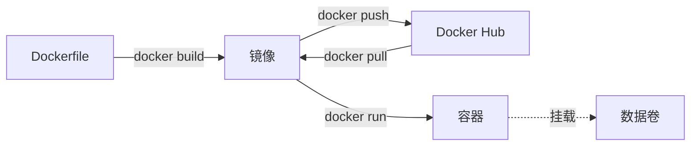
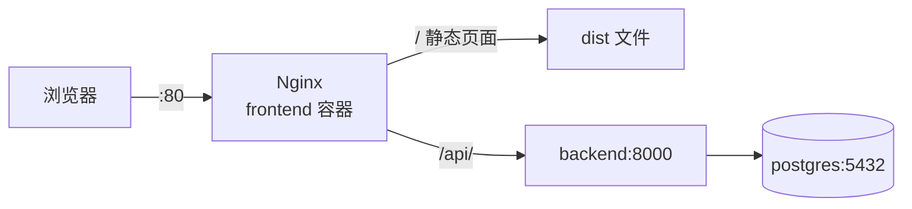

## 1. 概念与安装

### 1.1 四个核心概念

| 概念 | 是什么 | 类比 |
|--|--|--|
| **镜像（Image）** | 打包好的程序 + 运行环境，只读 | 安装包 |
| **容器（Container）** | 镜像运行起来的实例，可以同时跑多个 | 装好正在运行的程序 |
| **数据卷（Volume）** | 容器外保存数据的地方，删容器数据不丢 | 外接硬盘 |
| **网络（Network）** | 容器之间互相访问，用**服务名**当域名 | 局域网 |



### 1.2 安装

| 系统 | 安装方式 |
|--|--|
| Windows / macOS | 装 [Docker Desktop](https://www.docker.com/products/docker-desktop/)（Windows 需要先开启 WSL 2） |
| Linux | 装 Docker Engine，用下面的官方脚本 |

Linux 安装，并把当前用户加进 `docker` 组，以后不用每次 `sudo`：

```bash
curl -fsSL https://get.docker.com | sh
sudo usermod -aG docker $USER   # 重新登录后生效
docker version                  # 验证
docker run hello-world
```

### 1.3 daemon 配置文件

路径：Linux 是 `/etc/docker/daemon.json`，Docker Desktop 在 **Settings → Docker Engine** 里编辑。

```json
{
  "registry-mirrors": ["https://镜像加速地址"],
  "log-driver": "json-file",
  "log-opts": { "max-size": "10m", "max-file": "3" }
}
```

- `registry-mirrors`：国内拉取镜像慢时填加速地址（各云厂商控制台里能申请）
- `log-opts`：限制容器日志大小，**不配的话日志会一直涨，把硬盘写满**

修改后重启：`sudo systemctl restart docker`（Docker Desktop 点 *Apply & restart*）。

## 2. 常用命令

### 2.1 镜像

```bash
docker pull nginx:alpine          # 拉取镜像，冒号后是标签（版本）
docker images                     # 列出本地镜像
docker rmi nginx:alpine           # 删除镜像
docker build -t myapp:1.0 .       # 用当前目录的 Dockerfile 构建
docker tag myapp:1.0 用户名/myapp:1.0
docker push 用户名/myapp:1.0      # 推送到 Docker Hub（先 docker login）
```

### 2.2 容器

```bash
# 后台运行 nginx，本机 8080 端口映射到容器 80 端口
docker run -d --name web -p 8080:80 nginx:alpine

docker ps                  # 运行中的容器（-a 包括已停止的）
docker logs -f web         # 实时看日志
docker exec -it web sh     # 进入容器里的终端
docker stop web            # 停止
docker start web           # 启动
docker restart web         # 重启
docker rm -f web           # 删除（-f 运行中也强删）
docker cp web:/etc/nginx/nginx.conf .   # 容器和本机之间拷文件
```

`docker run` 常用参数：

| 参数 | 作用 |
|--|--|
| `-d` | 后台运行 |
| `--name` | 容器名 |
| `-p 本机:容器` | 端口映射 |
| `-v 本机路径:容器路径` | 挂载目录或数据卷 |
| `-e KEY=VALUE` | 环境变量 |
| `--restart unless-stopped` | 开机、崩溃后自动重启 |
| `--rm` | 退出后自动删除，临时用 |

### 2.3 清理

```bash
docker system df          # 查看占用空间
docker system prune       # 删掉停止的容器、无用网络、悬空镜像
docker system prune -a    # 连没被使用的镜像一起删
docker volume prune       # 删掉没被使用的数据卷（数据会丢，慎用）
```

## 3. Dockerfile：把自己的程序做成镜像

### 3.1 后端（Python / FastAPI）

`backend/Dockerfile`：

```dockerfile
FROM python:3.12-slim

WORKDIR /app

# 先只拷依赖清单，代码改了也能复用这一层缓存
COPY requirements.txt .
RUN pip install --no-cache-dir -r requirements.txt

COPY . .

EXPOSE 8000
CMD ["uvicorn", "main:app", "--host", "0.0.0.0", "--port", "8000"]
```

> [!WARNING]
> 容器里的服务必须监听 `0.0.0.0`，监听 `127.0.0.1` 的话只有容器自己能访问，端口映射了也连不上。

### 3.2 前端（Vue / React，多阶段构建）

`frontend/Dockerfile`：第一阶段用 Node 编译，第二阶段只把编译结果放进 Nginx，最终镜像里没有 Node 和 `node_modules`：

```dockerfile
# 阶段 1：编译
FROM node:22-alpine AS build
WORKDIR /app
COPY package*.json .
RUN npm ci
COPY . .
RUN npm run build

# 阶段 2：用 Nginx 提供静态文件
FROM nginx:alpine
COPY --from=build /app/dist /usr/share/nginx/html
COPY nginx.conf /etc/nginx/conf.d/default.conf
```

### 3.3 .dockerignore

放在 Dockerfile 同目录，构建时不拷这些文件，镜像更小、构建更快：

```text
node_modules
dist
.venv
__pycache__
.git
.env
```

### 3.4 常用指令

| 指令 | 作用 |
|--|--|
| `FROM` | 基础镜像，优先选 `slim` / `alpine` 版本 |
| `WORKDIR` | 工作目录 |
| `COPY` | 拷文件进镜像 |
| `RUN` | 构建时执行的命令 |
| `ENV` | 环境变量 |
| `EXPOSE` | 声明端口（只是说明，真正映射靠 `-p`） |
| `CMD` | 容器启动时执行的命令 |

## 4. docker compose：用一个文件管理多个容器

多个容器一条条 `docker run` 很难维护，写进 `docker-compose.yml`：

```yaml
services:
  web:
    image: nginx:alpine
    ports: ["8080:80"]
    volumes:
      - ./html:/usr/share/nginx/html:ro   # ro = 只读
    restart: unless-stopped
```

```bash
docker compose up -d            # 启动（在 yml 所在目录执行）
docker compose up -d --build    # 重新构建镜像再启动，改了代码用这个
docker compose ps               # 状态
docker compose logs -f 服务名    # 日志
docker compose exec 服务名 sh    # 进入容器
docker compose restart 服务名
docker compose down             # 停止并删除容器（数据卷保留）
docker compose down -v          # 连数据卷一起删（数据会丢）
```

## 5. 实战：前后端分离 + Nginx 反向代理

### 5.1 架构



- 只有 Nginx 对外暴露端口，后端和数据库只在 Docker 内部网络里
- 前端和接口**同一个域名**，`/api/` 开头的请求转给后端，不存在跨域问题

### 5.2 目录结构

```text
myproject/
├── docker-compose.yml     # 编排三个服务（5.6）
├── .env                   # 密码等敏感配置，不提交（5.5）
├── .gitignore
├── backend/
│   ├── Dockerfile         # 后端镜像（3.1）
│   ├── .dockerignore      # （3.3）
│   ├── requirements.txt   # （5.3）
│   └── main.py            # 后端入口（5.3）
└── frontend/
    ├── Dockerfile         # 编译 + Nginx 镜像（3.2）
    ├── .dockerignore      # （3.3）
    ├── nginx.conf         # 静态文件与 /api 代理（5.4）
    ├── vite.config.js     # 开发时的代理（5.4）
    ├── package.json
    ├── index.html
    └── src/
```

前端用 `npm create vite@latest frontend` 生成，再补上 `Dockerfile`、`.dockerignore`、`nginx.conf` 三个文件。

### 5.3 后端代码

`backend/requirements.txt`：

```text
fastapi
uvicorn[standard]
psycopg[binary]
```

`backend/main.py`：

```python
import os

import psycopg
from fastapi import FastAPI

app = FastAPI()
DATABASE_URL = os.environ["DATABASE_URL"]


@app.get("/health")
def health():
    with psycopg.connect(DATABASE_URL) as conn:
        conn.execute("SELECT 1")
    return {"status": "ok"}
```

路由写 `/health` 而不是 `/api/health`，因为 Nginx 转发时会去掉 `/api` 前缀（见 5.4）。

### 5.4 Nginx 配置

`frontend/nginx.conf`：

```nginx
server {
    listen 80;
    server_name _;

    root /usr/share/nginx/html;
    index index.html;

    # 前端路由（history 模式）：找不到文件就返回 index.html
    location / {
        try_files $uri $uri/ /index.html;
    }

    # 接口转发给后端；proxy_pass 末尾带 / 会去掉 /api 前缀
    # /api/users → http://backend:8000/users
    location /api/ {
        proxy_pass http://backend:8000/;
        proxy_set_header Host $host;
        proxy_set_header X-Real-IP $remote_addr;
        proxy_set_header X-Forwarded-For $proxy_add_x_forwarded_for;
        proxy_set_header X-Forwarded-Proto $scheme;
    }

    # 带哈希的静态资源长期缓存
    location /assets/ {
        expires 1y;
        add_header Cache-Control "public, immutable";
    }

    client_max_body_size 20m;   # 上传文件大小上限，默认只有 1m
    gzip on;
    gzip_types text/css application/javascript application/json;
}
```

> [!TIP]
> `proxy_pass` 末尾**有没有 `/`** 区别很大：`http://backend:8000/` 会去掉 `/api` 前缀，`http://backend:8000` 会原样转发 `/api/users`。按后端路由怎么写来选。

前端代码里接口地址直接写相对路径 `/api/...`，开发时在 Vite 里配同样的代理：

```js
// vite.config.js：在脚手架生成的配置里加上 server 这一段
export default defineConfig({
  plugins: [vue()],
  server: {
    proxy: {
      "/api": { target: "http://localhost:8000", rewrite: (p) => p.replace(/^\/api/, "") },
    },
  },
});
```

### 5.5 环境变量

`.env`（放在 `docker-compose.yml` 同目录，**加进 `.gitignore`**）：

```ini
POSTGRES_PASSWORD=change-me
DATABASE_URL=postgresql://postgres:change-me@db:5432/postgres
```

### 5.6 docker-compose.yml

```yaml
services:
  frontend:
    build: ./frontend
    ports: ["80:80"]
    depends_on: [backend]
    restart: unless-stopped

  backend:
    build: ./backend
    environment:
      DATABASE_URL: ${DATABASE_URL}
    depends_on:
      db:
        condition: service_healthy   # 等数据库真正可用再启动
    restart: unless-stopped

  db:
    image: postgres:17
    environment:
      POSTGRES_PASSWORD: ${POSTGRES_PASSWORD}
    volumes:
      - db-data:/var/lib/postgresql/data
    healthcheck:
      test: ["CMD-SHELL", "pg_isready -U postgres"]
      interval: 5s
      retries: 10
    restart: unless-stopped

volumes:
  db-data:
```

- 容器之间用**服务名**访问：后端连 `db:5432`，Nginx 转发到 `backend:8000`
- `backend` 和 `db` 没写 `ports`，外部访问不到，更安全
- 本地调试数据库时可以临时加 `ports: ["127.0.0.1:5432:5432"]`，只允许本机连

### 5.7 启动与验证

```bash
docker compose up -d --build
docker compose ps                      # 三个服务都是 running / healthy
curl http://localhost/                 # 返回前端页面
curl http://localhost/api/health       # 返回后端接口
docker compose logs -f backend         # 出问题看日志
```

## 6. 部署到服务器

**1. 服务器装好 Docker**（见 1.2），把项目传上去：

```bash
git clone 你的仓库 && cd myproject
# 在服务器上单独创建 .env，不要提交到仓库
```

**2. 启动**：

```bash
docker compose up -d --build
```

**3. 更新代码**：

```bash
git pull
docker compose up -d --build     # 只会重建有变化的服务
docker image prune -f            # 清掉旧镜像
```

**4. HTTPS**：在 Nginx 配置里加 443 端口，证书用 [Certbot](https://certbot.eff.org/) 申请后挂载进容器：

```nginx
server {
    listen 443 ssl;
    server_name example.com;
    ssl_certificate     /etc/nginx/certs/fullchain.pem;
    ssl_certificate_key /etc/nginx/certs/privkey.pem;
    # 其余 location 同 5.4
}

server {
    listen 80;
    server_name example.com;
    return 301 https://$host$request_uri;   # HTTP 跳转到 HTTPS
}
```

```yaml
  frontend:
    ports: ["80:80", "443:443"]
    volumes:
      - /etc/letsencrypt/live/example.com:/etc/nginx/certs:ro
```

> [!NOTE]
> Let's Encrypt 的 `live` 目录里是软链接，挂载后如果读不到证书，改成挂载整个 `/etc/letsencrypt`，路径相应调整。也可以换成 [Caddy](https://caddyserver.com/)，它能自动申请和续期证书。

## 7. 常见问题

| 现象 | 原因与解决 |
|--|--|
| 端口映射了却访问不了 | 服务监听了 `127.0.0.1`，改成 `0.0.0.0`；云服务器还要在安全组放行端口 |
| `port is already allocated` | 本机端口被占用，换一个本机端口，如 `-p 8081:80` |
| 后端连不上数据库 | 地址要写服务名 `db`，不是 `localhost`；加 `healthcheck` 等数据库就绪 |
| 刷新页面 404 | Nginx 没配 `try_files ... /index.html` |
| 接口 404 | 检查 `proxy_pass` 末尾的 `/` 和后端路由前缀是否匹配 |
| 上传文件报 413 | 调大 `client_max_body_size` |
| 改了代码没生效 | 用 `docker compose up -d --build`，只 `restart` 不会重新构建 |
| 硬盘被占满 | `docker system df` 查看，`docker system prune` 清理；配置日志大小限制（1.3） |

## 8. 相关链接

| 链接 | 说明 |
|--|--|
| [Docker 文档](https://docs.docker.com/) | 官方文档 |
| [Dockerfile 参考](https://docs.docker.com/reference/dockerfile/) | 所有指令 |
| [Compose 文件参考](https://docs.docker.com/reference/compose-file/) | `docker-compose.yml` 所有字段 |
| [Docker Hub](https://hub.docker.com/) | 搜索官方镜像 |
| [Nginx 文档](https://nginx.org/en/docs/) | 配置指令 |
| [Certbot](https://certbot.eff.org/) | 免费 HTTPS 证书 |
