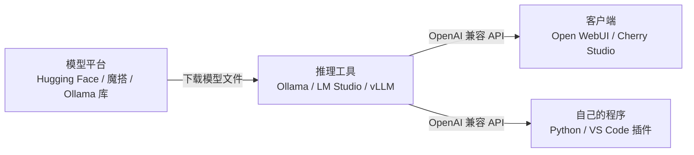

> [!NOTE]
> 本地部署 = 模型文件下载到自己电脑上，用推理工具跑起来。数据不出本机、不花 API 费用、断网也能用；代价是要有足够的显存 / 内存，效果也比不上最强的云端模型。

## 1. 整体结构



三层各选一个即可。推理工具几乎都提供 **OpenAI 兼容接口**，所以客户端和代码可以随便搭配，换底层工具不用改上层。

## 2. 推理工具对比

| 工具 | 形态 | 优点 | 缺点 | 适合 |
|--|--|--|--|--|
| **[Ollama](https://ollama.com/)** | 命令行 + 后台服务（也有桌面版） | 一条命令下载并运行，生态最好，几乎所有客户端都支持 | 默认上下文较短，高级参数要写 Modelfile | **个人电脑首选** |
| **[LM Studio](https://lmstudio.ai/)** | 图形界面 | 界面里搜索、下载、聊天、开 API 一条龙；Mac 上支持 MLX 加速 | 闭源（个人免费）；国内直连 Hugging Face 下载慢 | 不想碰命令行 |
| **[llama.cpp](https://github.com/ggml-org/llama.cpp)** | 命令行 / 库 | Ollama、LM Studio 的底层引擎，参数最全，CPU 也能跑 | 要自己下模型、调参数 | 想精细控制、嵌入式设备 |
| **[vLLM](https://docs.vllm.ai/)** | Python 服务 | 吞吐量高，支持多卡、多人并发 | 基本只支持 Linux + NVIDIA 显卡，显存占用大 | 服务器、团队共用 |
| [SGLang](https://docs.sglang.ai/) | Python 服务 | 与 vLLM 同类，部分场景更快 | 同上 | 服务器 |
| [Jan](https://jan.ai/) | 图形界面 | 开源版的 LM Studio | 功能少一些 | 想用开源 GUI |

一句话：**个人电脑用 Ollama（或 LM Studio），服务器多人用 vLLM**。

## 3. 客户端（聊天界面）对比

推理工具本身只有很简陋的聊天功能，日常使用再配一个客户端：

| 客户端 | 形态 | 特点 |
|--|--|--|
| **[Open WebUI](https://openwebui.com/)** | 网页（Docker 部署） | 界面接近 ChatGPT，多用户、知识库、联网搜索，**局域网共享首选** |
| **[Cherry Studio](https://cherry-ai.com/)** | 桌面应用 | 国产，同时接本地模型和各家云端 API，内置知识库、助手 |
| [Chatbox](https://chatboxai.app/) | 桌面 / 手机 | 轻量，手机上也能连家里电脑的模型 |
| [AnythingLLM](https://anythingllm.com/) | 桌面 / Docker | 主打文档问答（RAG） |
| [Dify](https://dify.ai/) | Docker | 搭建 AI 应用和工作流，偏开发 |
| [Continue](https://continue.dev/) / [Cline](https://cline.bot/) | VS Code 插件 | 用本地模型写代码 |

## 4. 开源模型平台

| 平台 | 说明 |
|--|--|
| **[Hugging Face](https://huggingface.co/models)** | 全球最大的模型仓库，几乎所有开源模型首发在这里 |
| **[魔搭 ModelScope](https://modelscope.cn/models)** | 阿里的模型平台，**国内下载快**，主流模型基本都有同步 |
| [Ollama 模型库](https://ollama.com/library) | 已经转好格式的模型，`ollama pull 名字` 直接下载 |
| [HF-Mirror](https://hf-mirror.com/) | Hugging Face 的国内镜像站，设置一个环境变量即可使用 |

常见的开源模型系列（新版本更新很快，以平台上最新的为准）：

| 系列 | 出品方 | 特点 |
|--|--|--|
| **Qwen（通义千问）** | 阿里 | 中文好，从 0.6B 到几百 B 尺寸齐全，**中文场景首选** |
| **DeepSeek** | 深度求索 | 推理能力强；完整版太大，本地一般用蒸馏的小尺寸版本 |
| GLM | 智谱 | 中文好，有视觉版本 |
| Llama | Meta | 英文生态最大 |
| Gemma | Google | 小尺寸效果好，支持看图 |
| gpt-oss | OpenAI | OpenAI 的开源权重模型，有 20B / 120B 两个尺寸 |
| Mistral | Mistral AI | 欧洲团队，小模型效率高 |

### 4.1 模型文件名怎么看

以 `Qwen3-8B-GGUF` 仓库里的 `Q4_K_M` 文件为例：

| 部分 | 含义 |
|--|--|
| `8B` | 80 亿参数，越大越聪明、越吃显存 |
| `Instruct` / `Chat` | 经过对话微调，**聊天用这种**；`Base` 是没微调的基座模型 |
| `GGUF` | llama.cpp / Ollama / LM Studio 用的格式；vLLM 用原始的 safetensors 格式 |
| `Q4_K_M` | 量化精度：4 bit。常见的有 `Q4_K_M`（最常用，性价比高）、`Q5_K_M`、`Q8_0`、`F16`（不量化） |
| `AWQ` / `GPTQ` | 给 vLLM 这类 GPU 引擎用的量化格式 |

## 5. 硬件：能跑多大的模型

估算公式：**显存 ≈ 参数量（B）× 量化位数 ÷ 8 + 1～2 GB**（上下文越长，额外占用越多）。

| 显存 / 内存 | Q4 量化能跑 | 例子 |
|--|--|--|
| 8 GB | 7B～8B | Qwen3-8B、Gemma 小尺寸 |
| 12～16 GB | 14B | Qwen3-14B、gpt-oss-20B（MoE，16 GB 可跑） |
| 24 GB | 30B～32B | Qwen3-32B、Qwen3-30B-A3B |
| 48 GB 以上 | 70B | Llama 70B 级别 |

- **NVIDIA 显卡**最省心；AMD、Intel 显卡在 Ollama / LM Studio 里也能用，但兼容性差一些。
- **Apple Silicon Mac** 内存和显存共用，32 GB 内存的 Mac 能跑 30B 级别的模型。
- **只有 CPU** 也能跑小模型，但速度只有每秒几个字。
- 型号带 `A3B` 这种的是 **MoE 模型**：总参数大，但每次只激活一小部分，速度比同尺寸的普通模型快很多。

## 6. Ollama 上手

**1. 安装**

| 系统 | 方式 |
|--|--|
| Windows / macOS | 官网 [ollama.com/download](https://ollama.com/download) 下载安装包 |
| Linux | 执行下面的安装脚本 |

```bash
curl -fsSL https://ollama.com/install.sh | sh
```

**2. 下载并运行模型**

```bash
ollama run qwen3:8b          # 第一次会自动下载，下载完直接进入对话，/bye 退出
ollama pull gemma3:4b        # 只下载不运行
ollama list                  # 已下载的模型
ollama ps                    # 正在运行的模型，PROCESSOR 列能看出跑在 GPU 还是 CPU
ollama show qwen3:8b         # 模型信息：参数量、上下文长度、量化
ollama stop qwen3:8b         # 从显存里卸载
ollama rm gemma3:4b          # 删除
```

也可以直接跑 Hugging Face / 魔搭上的 GGUF 模型：

```bash
ollama run hf.co/Qwen/Qwen3-8B-GGUF:Q4_K_M
ollama run modelscope.cn/Qwen/Qwen3-8B-GGUF      # 国内更快
```

**3. 常用环境变量**

| 变量 | 作用 |
|--|--|
| `OLLAMA_MODELS` | 模型存放目录，默认在 C 盘用户目录下，**模型很大，建议改到别的盘** |
| `OLLAMA_HOST` | 监听地址，改成 `0.0.0.0:11434` 才能让局域网其他设备访问 |
| `OLLAMA_KEEP_ALIVE` | 空闲多久后卸载模型，默认 5 分钟，`-1` 表示常驻 |
| `OLLAMA_CONTEXT_LENGTH` | 默认上下文长度，做文档问答时调大，比如 `16384` |

Windows 在「系统属性 → 环境变量」里添加，改完**退出托盘里的 Ollama 再重新打开**；Linux 用 `sudo systemctl edit ollama` 在 `[Service]` 下加 `Environment="OLLAMA_HOST=0.0.0.0:11434"`，然后 `sudo systemctl restart ollama`。

> [!WARNING]
> Ollama 的接口**没有任何密码**。开了 `0.0.0.0` 只在家里 / 公司局域网用，千万不要把 11434 端口映射到公网，网上被扫到后白嫖算力、删模型的案例很多。

**4. 自定义模型（Modelfile）**

想固定系统提示词、调大上下文，写一个 `Modelfile`：

```text
FROM qwen3:8b
PARAMETER num_ctx 16384
PARAMETER temperature 0.6
SYSTEM 你是一个简洁的中文助手，回答控制在 200 字以内。
```

```bash
ollama create my-assistant -f Modelfile
ollama run my-assistant
```

## 7. LM Studio 上手

1. 官网 [lmstudio.ai](https://lmstudio.ai/) 下载安装。
2. 左侧 **Discover（放大镜）** 搜索模型名，如 `qwen3 8b`，选 `Q4_K_M` 下载。右边会提示你的显存能不能完整装下（绿色 = 可以全部放进 GPU）。
3. 顶部选择模型加载，就可以在 **Chat** 里对话。
4. 左侧 **Developer** 打开 *Start server*，默认地址 `http://localhost:1234/v1`，就是 OpenAI 兼容接口。

> [!TIP]
> 国内搜不到或下载很慢时，从魔搭或 HF-Mirror 手动下载 `.gguf` 文件，放到 LM Studio 的模型目录（*My Models* 页面能看到路径），按 `发布者/模型名/文件.gguf` 的层级放好即可识别。

## 8. 下载模型文件（命令行）

vLLM、llama.cpp 需要自己下载模型：

```bash
# Hugging Face
pip install -U huggingface_hub
hf download Qwen/Qwen3-8B-GGUF --include "*Q4_K_M*" --local-dir ./models

# 国内用镜像：先设置环境变量再执行上面的命令
export HF_ENDPOINT=https://hf-mirror.com          # Windows PowerShell: $env:HF_ENDPOINT="https://hf-mirror.com"

# 魔搭
pip install modelscope
modelscope download --model Qwen/Qwen3-8B-GGUF --include "*Q4_K_M*" --local_dir ./models
```

## 9. 配一个聊天界面：Open WebUI

已经装好 Docker 的话（见 [Docker 实用教程](/blog/2026/09/24/docker-guide/)），一条命令启动：

```bash
docker run -d -p 3000:8080 \
  --add-host=host.docker.internal:host-gateway \
  -v open-webui:/app/backend/data \
  --name open-webui --restart always \
  ghcr.io/open-webui/open-webui:main
```

1. 浏览器打开 `http://localhost:3000`，**第一个注册的账号就是管理员**。
2. 它会自动连接本机的 Ollama（`http://host.docker.internal:11434`），左上角就能选模型。
3. 用 LM Studio 或 vLLM 的话：**管理员设置 → 外部连接 → OpenAI API** 里填 `http://host.docker.internal:1234/v1`（vLLM 是 8000 端口）。
4. 局域网其他设备访问 `http://你的电脑IP:3000`，每人注册一个账号即可共用。

不想装 Docker 的话用 **Cherry Studio**：设置 → 模型服务 → Ollama，地址填 `http://localhost:11434`，点「管理」添加已下载的模型。

## 10. 在代码里调用

所有工具都兼容 OpenAI 接口，直接用 OpenAI 的 SDK，改 `base_url` 就行：

| 工具 | base_url |
|--|--|
| Ollama | `http://localhost:11434/v1` |
| LM Studio | `http://localhost:1234/v1` |
| vLLM | `http://localhost:8000/v1` |

```python
# pip install openai
from openai import OpenAI

client = OpenAI(base_url="http://localhost:11434/v1", api_key="ollama")  # 本地不校验 key，随便填

resp = client.chat.completions.create(
    model="qwen3:8b",
    messages=[{"role": "user", "content": "用一句话解释什么是量化"}],
)
print(resp.choices[0].message.content)
```

命令行快速测试：

```bash
curl http://localhost:11434/v1/chat/completions \
  -H "Content-Type: application/json" \
  -d '{"model": "qwen3:8b", "messages": [{"role": "user", "content": "你好"}]}'
```

## 11. 服务器部署：vLLM

Linux + NVIDIA 显卡，给多人用：

```bash
pip install vllm

# 从 Hugging Face 下载并启动，默认端口 8000
vllm serve Qwen/Qwen3-8B --max-model-len 16384 --api-key 自己设一个密钥

# 国内从魔搭下载
VLLM_USE_MODELSCOPE=true vllm serve Qwen/Qwen3-8B --max-model-len 16384 --api-key 自己设一个密钥
```

| 参数 | 作用 |
|--|--|
| `--max-model-len` | 最大上下文长度，显存不够时先调小它 |
| `--gpu-memory-utilization` | 占用显存比例，默认 0.9 |
| `--tensor-parallel-size 2` | 用 2 张卡跑一个模型 |
| `--api-key` | 调用时要带的密钥，对外提供服务一定要设 |

调用方式同第 10 节，`base_url` 换成 `http://服务器IP:8000/v1`，`api_key` 填上面设的密钥。

## 12. 常见问题

| 现象 | 原因与解决 |
|--|--|
| 回答特别慢 | `ollama ps` 看 PROCESSOR 列，显示 CPU 或 `50%/50% CPU/GPU` 说明显存不够，换小一号的模型或更低的量化 |
| 显存不足 / 程序崩溃 | 换小模型；调小上下文长度；关掉其他占显存的程序 |
| 文档问答时"忘了"前面的内容 | 上下文太短，调大 `num_ctx` / `OLLAMA_CONTEXT_LENGTH` |
| 回答前输出一大段"思考过程" | 推理模型（Qwen3、DeepSeek-R1 等）的正常行为；Qwen3 可以在提问末尾加 `/no_think` 关掉 |
| 下载很慢或失败 | 改用魔搭、HF-Mirror，或 Ollama 的 `modelscope.cn/` 前缀 |
| C 盘被占满 | 设置 `OLLAMA_MODELS` 把模型放到其他盘，再把旧目录的模型移过去 |
| 其他设备连不上 | 设置 `OLLAMA_HOST=0.0.0.0:11434`，并在防火墙放行端口 |

## 13. 相关链接

| 链接 | 说明 |
|--|--|
| [Ollama 文档](https://docs.ollama.com/) | 命令、API、Modelfile |
| [LM Studio 文档](https://lmstudio.ai/docs) | 图形界面与本地服务 |
| [llama.cpp](https://github.com/ggml-org/llama.cpp) | 底层引擎与量化工具 |
| [vLLM 文档](https://docs.vllm.ai/) | 服务器部署参数 |
| [Open WebUI 文档](https://docs.openwebui.com/) | 部署与配置 |
| [Hugging Face](https://huggingface.co/models) / [魔搭](https://modelscope.cn/models) | 下载模型 |
