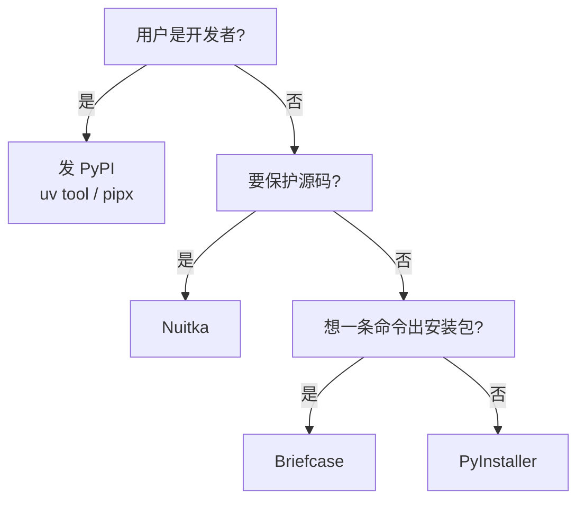

 正文的 Actions 示例里有双花括号表达式，整篇关掉 Liquid 解析 


> [!NOTE]
> 打包 = 把解释器、依赖、资源和代码装在一起，用户不装 Python 也能运行。**不能交叉编译**：哪个系统的包就在哪个系统上打。

## 1. 工具对比与选择

| 工具 | 原理 | 优点 | 缺点 |
|--|--|--|--|
| **[PyInstaller](https://pyinstaller.org/)** | 打包 `.pyc` 字节码 + 解释器 | 最流行、兼容性最好、打包快 | 容易被反编译；单文件启动慢；易被杀软误报 |
| **[Nuitka](https://nuitka.net/)** | 转成 C 再编译成机器码 | 难反编译、运行更快 | 需要 C 编译器；编译慢 |
| **[cx_Freeze](https://cx-freeze.readthedocs.io/)** | 同 PyInstaller | 自带生成 MSI / DMG / AppImage / deb | 资料少，无单文件模式 |
| **[Briefcase](https://briefcase.readthedocs.io/)** | 独立版 Python + 原生模板 | 一条命令出安装包，支持移动端 | 项目结构要按它的约定 |
| **uv tool / pipx** | 发布到 PyPI，用户自己装 | 最省事 | 只适合给开发者用的命令行工具 |



| 模式 | 产物 | 适合 |
|--|--|--|
| 文件夹（onedir） | exe + 依赖文件夹，启动快 | **正式发布，再做成安装包** |
| 单文件（onefile） | 一个 exe，每次启动先解压 | 小工具、临时发给别人 |

> [!WARNING]
> 打包不是加密，PyInstaller 的产物几分钟就能还原源码。**密钥、Token 不要写进代码。**

## 2. 打包前准备

**1. 建干净的虚拟环境**（环境里多余的库会被打包进去）：

```bash
python -m venv .venv
.venv\Scripts\activate        # Windows
source .venv/bin/activate     # macOS / Linux
pip install -r requirements.txt
```

**2. 资源路径基于 `__file__`**，不要用相对路径：

```python
from pathlib import Path
ASSETS = Path(__file__).resolve().parent / "assets"
```

**3. 可写文件放用户目录**（单文件模式的临时目录退出即删，`Program Files` 无写权限）：

```python
from platformdirs import user_data_dir   # pip install platformdirs
DATA_DIR = Path(user_data_dir("MyApp"))
DATA_DIR.mkdir(parents=True, exist_ok=True)
```

## 3. PyInstaller

```bash
pip install pyinstaller

# 文件夹模式，GUI 程序，带资源和图标
pyinstaller main.py --windowed --name MyApp --icon app.ico --add-data "assets:assets"

# 单文件模式
pyinstaller main.py --onefile --windowed --name MyApp
```

| 参数 | 作用 |
|--|--|
| `--onefile` / `-F` | 单文件 |
| `--windowed` / `-w` | 不显示控制台；macOS 上生成 `.app` |
| `--icon` | 图标（Windows `.ico`，macOS `.icns`） |
| `--add-data 源:目标` | 附带资源（PyInstaller 6 之前 Windows 用 `;`） |
| `--hidden-import` / `--collect-all` | 补充没被发现的模块 / 整个包 |
| `--clean` | 清缓存重打 |

产物在 `dist/MyApp/`。之后改生成的 `MyApp.spec`，用 `pyinstaller MyApp.spec` 打包，并提交到仓库。

**排错**：去掉 `--windowed` 重新打包，在命令行运行 exe 看报错。

## 4. Nuitka

**1. 装 C 编译器**：

| 系统 | 操作 |
|--|--|
| Windows | 装 [VS 生成工具](https://visualstudio.microsoft.com/zh-hans/visual-cpp-build-tools/)（勾选"使用 C++ 的桌面开发"），或首次运行时让 Nuitka 自动下载 MinGW64 |
| macOS | `xcode-select --install` |
| Linux | `sudo apt install gcc patchelf` |

**2. 打包**：

```bash
pip install nuitka zstandard

python -m nuitka --mode=standalone \
  --windows-console-mode=disable \
  --windows-icon-from-ico=app.ico \
  --enable-plugin=pyside6 \
  --include-data-dir=assets=assets \
  --output-dir=build \
  --output-filename=MyApp \
  main.py
```

| 参数 | 作用 |
|--|--|
| `--mode=standalone` / `onefile` / `app` | 文件夹 / 单文件 / 桌面应用（macOS 上生成 `.app`） |
| `--windows-console-mode=disable` | 不显示控制台 |
| `--enable-plugin=` | GUI 框架插件：`pyside6`、`pyqt6`、`tk-inter` |
| `--include-data-dir=源=目标` | 附带资源文件夹 |
| `--include-package=` | 补充没被发现的包 |

参数可以写进 `main.py` 顶部，之后直接 `python -m nuitka main.py`：

```python
# nuitka-project: --mode=standalone
# nuitka-project: --enable-plugin=pyside6
```

## 5. 减小体积

**1. 找出大文件：**

```bash
du -ah dist/MyApp | sort -rh | head -20
```

**2. 换轻量依赖（效果最明显）：**

| 原依赖 | 换成 |
|--|--|
| `opencv-python` | `opencv-python-headless` |
| `PySide6` | `PySide6-Essentials` |
| `torch`（带 CUDA） | CPU 版：`pip install torch --index-url https://download.pytorch.org/whl/cpu` |
| 只做推理的 PyTorch 模型 | 导出 ONNX，用 `onnxruntime` |

**3. 打包时排除：**

```bash
# PyInstaller
pyinstaller main.py --exclude-module tkinter --exclude-module unittest --optimize 2 --noupx

# Nuitka
python -m nuitka --mode=standalone \
  --nofollow-import-to=tkinter,unittest \
  --python-flag=no_docstrings,no_asserts \
  --include-qt-plugins=platforms,styles \
  --noinclude-qt-translations \
  main.py
```

PyInstaller 排除 Qt 翻译文件、大 DLL：在 spec 的 `Analysis` 后加

```python
a.datas = [d for d in a.datas if "translations" not in d[0]]
a.binaries = [b for b in a.binaries if "Qt6WebEngine" not in b[0]]
```

> [!WARNING]
> 每排除一项，都要把所有功能测一遍。**不要用 UPX 压缩**：杀软误报多、可能压坏 DLL，打成安装包后下载体积也省不了多少。

**4. 分发时压缩：**

| 格式 | 命令 / 设置 |
|--|--|
| 7z | `7z a -t7z -mx=9 MyApp.7z dist/MyApp` |
| Inno Setup | `Compression=lzma2/ultra64` + `SolidCompression=yes` |
| DMG | `hdiutil create ... -format ULFO` |
| Linux | `tar -cJf MyApp.tar.xz MyApp/` |

## 6. Windows：Inno Setup 安装包

**1. 安装**：`winget install JRSoftware.InnoSetup`。中文界面需从 [Translations](https://jrsoftware.org/files/istrans/) 下载 `ChineseSimplified.isl`，放进安装目录的 `Languages`。

**2. 写 `setup.iss`：**

```ini
[Setup]
AppName=MyApp
AppVersion=1.0.0
DefaultDirName={autopf}\MyApp
DefaultGroupName=MyApp
OutputDir=installer
OutputBaseFilename=MyApp-1.0.0-setup
SetupIconFile=app.ico
Compression=lzma2/ultra64
SolidCompression=yes

[Languages]
Name: "chs"; MessagesFile: "compiler:Languages\ChineseSimplified.isl"

[Tasks]
Name: "desktopicon"; Description: "创建桌面快捷方式"

[Files]
Source: "dist\MyApp\*"; DestDir: "{app}"; Flags: recursesubdirs

[Icons]
Name: "{group}\MyApp"; Filename: "{app}\MyApp.exe"
Name: "{autodesktop}\MyApp"; Filename: "{app}\MyApp.exe"; Tasks: desktopicon

[Run]
Filename: "{app}\MyApp.exe"; Description: "立即运行"; Flags: postinstall nowait
```

**3. 编译**：`iscc setup.iss`，产物在 `installer/`。

**4. 签名（可选）**：没签名的程序会触发 SmartScreen 警告。有代码签名证书的话，用 `signtool` 给 exe 和安装包签名。

其他工具：NSIS（`.exe`）、WiX（`.msi`，企业部署用）、MSIX（上架 Microsoft Store）。

## 7. macOS：签名、DMG、公证

**1. 打包出 `.app`**：PyInstaller 加 `--windowed`，Nuitka 用 `--mode=app`。

**2. 签名**（需要 Apple Developer 账号）：

```bash
codesign --deep --force --options runtime --timestamp \
  --sign "Developer ID Application: 你的名字 (TEAMID)" dist/MyApp.app
```

**3. 做 DMG：**

```bash
hdiutil create -volname MyApp -srcfolder dist/MyApp.app -ov -format ULFO MyApp.dmg
# 或带"拖到应用程序"界面：brew install create-dmg
create-dmg --volname MyApp --app-drop-link 450 120 MyApp.dmg dist/MyApp.app
```

**4. 公证并装订：**

```bash
xcrun notarytool submit MyApp.dmg --keychain-profile "notary" --wait
xcrun stapler staple MyApp.dmg
```

> [!NOTE]
> 不签名的话，用户要去"系统设置 → 隐私与安全性"手动放行。M 系列 Mac 打出的是 arm64 包，Intel Mac 需要单独打。

## 8. Linux：AppImage / deb

**1. 在最老的目标系统上打包**（如 Ubuntu 22.04），否则老系统会报 `GLIBC_2.xx not found`。

**2. AppImage：**

```text
MyApp.AppDir/
├── AppRun          # exec "$(dirname "$0")/usr/bin/MyApp" "$@"
├── myapp.desktop
├── myapp.png
└── usr/bin/        # dist/MyApp/ 的内容
```

```bash
chmod +x MyApp.AppDir/AppRun
appimagetool MyApp.AppDir MyApp-x86_64.AppImage
```

**3. deb / rpm**（用 [fpm](https://fpm.readthedocs.io/)）：

```bash
fpm -s dir -t deb -n myapp -v 1.0.0 dist/MyApp/=/opt/myapp/
```

## 9. GitHub Actions 同时打三个系统

打标签后自动构建，发布流程见 [GitHub 上手](/blog/2026/09/23/github-guide/)：

```yaml
# .github/workflows/build.yml
name: Build
on:
  push:
    tags: ["v*"]
jobs:
  build:
    strategy:
      matrix:
        os: [windows-latest, macos-latest, ubuntu-22.04]
    runs-on: ${{ matrix.os }}
    steps:
      - uses: actions/checkout@v4
      - uses: actions/setup-python@v5
        with:
          python-version: "3.12"
      - run: pip install -r requirements.txt pyinstaller
      - run: pyinstaller MyApp.spec
      - uses: actions/upload-artifact@v4
        with:
          name: MyApp-${{ runner.os }}
          path: dist/
```

## 10. 相关链接

| 链接 | 说明 |
|--|--|
| [PyInstaller 文档](https://pyinstaller.org/en/stable/) | 参数、spec 文件 |
| [Nuitka 用户手册](https://nuitka.net/user-documentation/) | 编译器、插件 |
| [Briefcase 文档](https://briefcase.readthedocs.io/) | 一条龙出安装包 |
| [Inno Setup](https://jrsoftware.org/isinfo.php) | Windows 安装包 |
| [Apple 公证文档](https://developer.apple.com/documentation/security/notarizing-macos-software-before-distribution) | macOS 签名与公证 |
| [AppImage 文档](https://docs.appimage.org/) | Linux 打包 |

